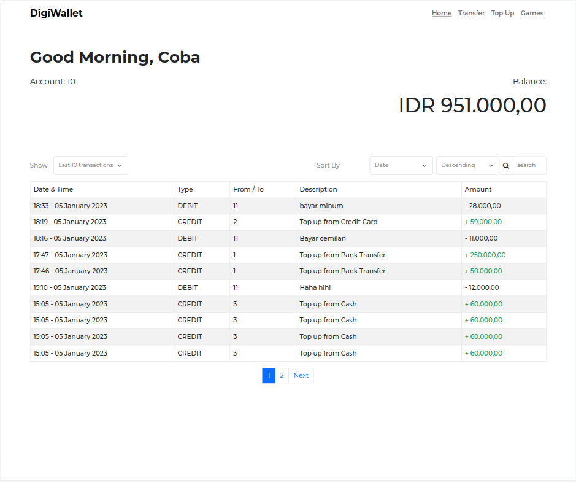
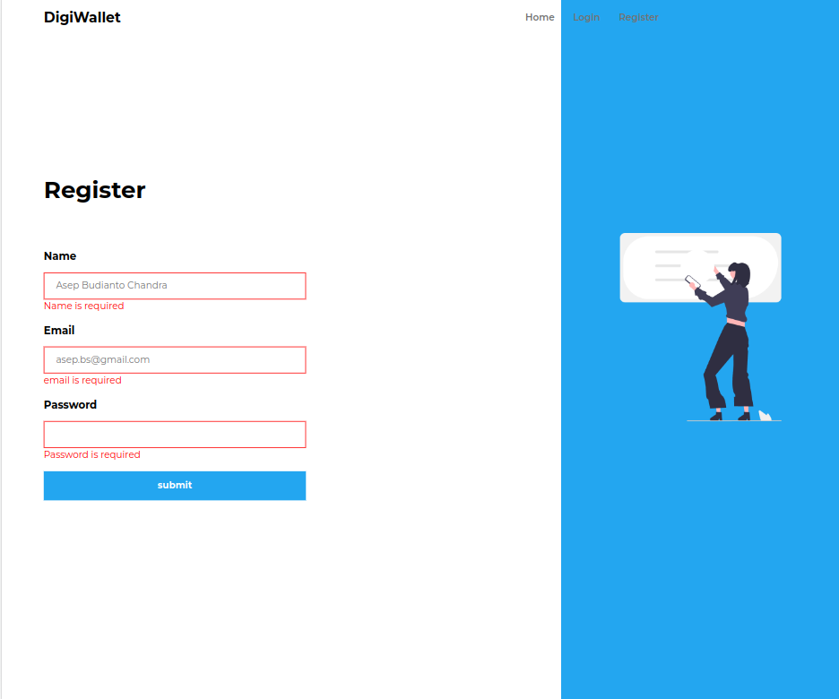
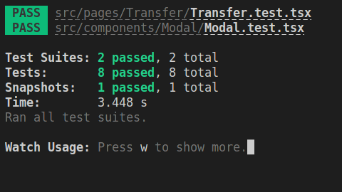

# Assignment React Starter

This React Project is a digital wallet application build with integration with golang backend

## Step to Run the Provided Backend :

1. Go to the backend folder

2. see the env file (.env)

3. create database and migrate based on the env file and file (setup.sql)

4. Run the \*-server. If you use linux, run linux-server. If you use mac, run mac-server

5. You may visit the API documentation by going to the http://localhost:8080/docs

## Note About Permission Issue:

If you encounter with permission issue when executing the server, you may run:

chmod +x linux-server

OR

chmod +x mac-server

## Dependencies and running the project

This project is build with react-cookie, react-router-dom, react-redux, redux-toolkit, moment, bootstrap, and many others.

With the backend and db running, we can run the app. This project also assumed that backend is running at port 8080

To run the application, first, clone the project and install the dependencies, by typing `npm install` in the root folder terminal.

Run the project bu typing `npm run start` in the root folder terminal and open the app in localhost:3000.

## Screenshots

Here are a few screenshot the app screens.

### Home

### login

### register

### transfer

### topup

### games

## Test

This project also includes unit test for transfer page by:

- Testing modal as part of transfer page to see if it is rendered

- Testing modal print by mocking window print

- Testing the snapshot of transfer page

- Testing disabled source wallet form input

- Testing the header displayed of transfer page

- Testing the warning of no transfer amount input

- Testing the warning of amount less than 10000

- Testing the warning if transfer amount higher than balance (default, because initial user has 0 balance)
